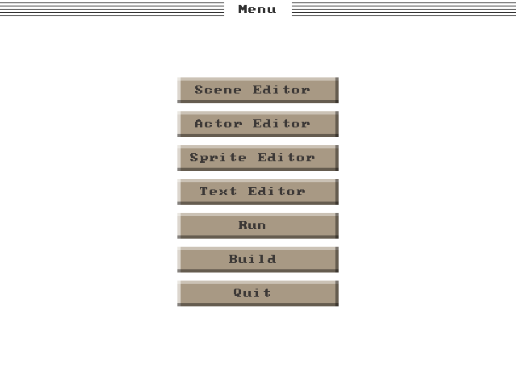

# Apollon
> The graphical user interface for Coelum.


## Installing
> To install Apollon, you must first install [Coelum](https://github.com/sebbekarlsson/coelum)
> along with all its dependencies.

> Then create a config file and modify it:
```bash
cp config.example.he config.he
vim config.he
```

> Then compile & run:
```
make && ./apollon.out
```
